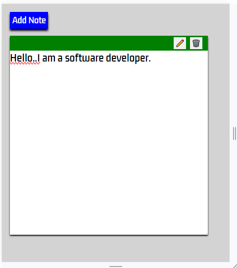
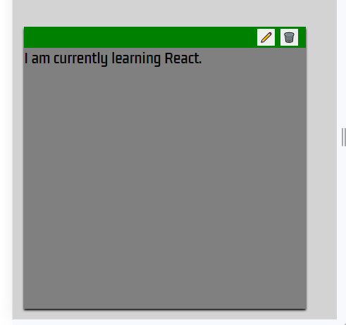
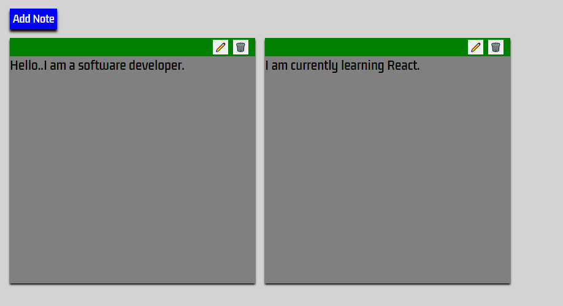

# Notes App

This project features a simple, dynamic, and interactive note app created using HTML, CSS, and Vanilla JavaScript.

## Table of Contents
- [Screenshots](#screenshots)
- [Description](#description)
- [Features](#features)
- [How to Use](#how-to-use)
- [Project Structure](#project-structure)
- [Development](#development)
- [Local Storage](#local-storage)
- [License](#license)
- [Author](#author)

## Screenshots
1. Screenshot1

2. Screenshot2

3. Screenshot3

## Description

The Notes App provides a user-friendly interface for creating and managing notes. Users can add new notes, edit them, delete them, and store the notes locally. The app is designed to be straightforward and easy to use.

## Features

- Add new notes by clicking the "Add Note" button.
- Edit notes by clicking the edit button on each note.
- Delete notes by clicking the delete button on each note.
- Automatically stores notes locally to persist data.

## How to Use

1. Open the `index.html` file in a web browser.
2. Click the "Add Note" button to create a new note.
3. Edit a note by clicking the edit button on the note.
4. Delete a note by clicking the delete button on the note.
5. The app will automatically store your notes locally, ensuring your data is persistent.

## Project Structure

- `index.html`: HTML file containing the structure of the Notes App.
- `style.css`: CSS file for styling the Notes App interface.
- `script.js`: JavaScript file for creating the dynamic functionality of the Notes App.

## Development

To contribute to the project or make modifications, follow these steps:

1. Clone the repository.
2. Make changes to the HTML, CSS, or JavaScript files.
3. Test the changes in a web browser.
4. Submit a pull request if you would like to contribute your modifications.

## Local Storage

The app uses local storage to persistently store notes, ensuring that your data is saved even after you close the browser.

## License

This project is licensed under the MIT License - see the [LICENSE.md](LICENSE.md) file for details.

## Author

- **Hosea Nganga**

Feel free to use, modify, and contribute to this Notes App project!

